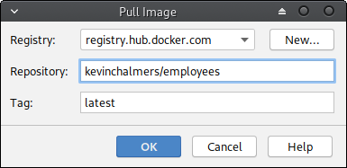
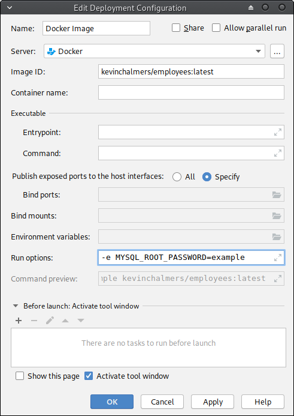
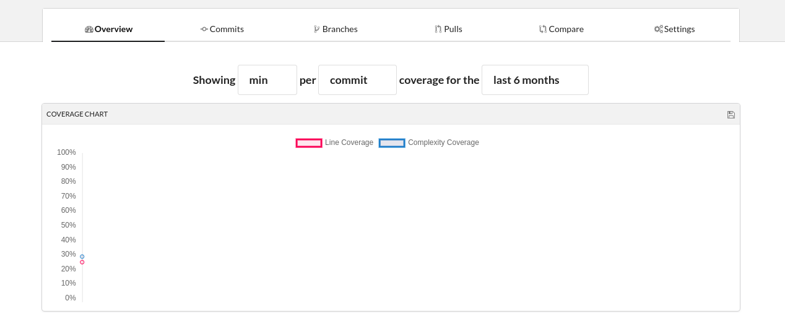

# Lab 07: Integration Testing

This lab will build further automated tests for our project, focusing on integration testing as supported via Travis CI.  Most of the work in this lab will be around writing Travis configuration files, although we will do some work in our Java code.

## Behavioural Objectives

- [ ] **Create** *multi-stage builds with Travis CI.*
- [ ] **Create** *integration tests.*
- [ ] **Use code coverage** from *version control.*

## Updating Project

We have some tidying up in our existing project to make our life easier.  We will modify the `pom.xml` file to use up-to-date versions of our dependencies, 

### Updating Maven `pom.xml` File

When we first added dependencies to our Maven configuration we specified hard version numbers as follows:

```xml
<dependencies>
    <dependency>
        <groupId>mysql</groupId>
        <artifactId>mysql-connector-java</artifactId>
        <version>5.1.44</version>
    </dependency>

    <dependency>
        <groupId>org.junit.jupiter</groupId>
        <artifactId>junit-jupiter-api</artifactId>
        <version>5.1.0</version>
        <scope>test</scope>
    </dependency>
</dependencies>
```

A better strategy is to let Maven pull the latest version of our dependencies.  We do this using the notation `[x.y, )`.  This tells Maven to use version `x.y` or later.  Thus, our `pom.xml` dependencies become:

```xml
<dependencies>
    <dependency>
        <groupId>mysql</groupId>
        <artifactId>mysql-connector-java</artifactId>
        <version>[8.0,)</version>
    </dependency>

    <dependency>
        <groupId>org.junit.jupiter</groupId>
        <artifactId>junit-jupiter-api</artifactId>
        <version>[5.1.0,)</version>
        <scope>test</scope>
    </dependency>
</dependencies>
```

### Updating `App.java`

We will also modify our `App.java` file so we can set the hostname for the database.  This is will become important later.  We will also update the MySQL driver used in Java.

#### Updating `connect`

Below is our updated `connect` method.  The updated lines are:

- The method definition adds a `location` parameter.
- `Class.forName` which uses the most up-to-date MySQL driver.
- `Driver.getConnection` uses the `location`, and also updates the parameters to use `allowPublicKeyRetrieval=true` as we are using a more up-to-date version of MySQL.

```java
public void connect(String location)
{
    try
    {
        // Load Database driver
        Class.forName("com.mysql.cj.jdbc.Driver");
    }
    catch (ClassNotFoundException e)
    {
        System.out.println("Could not load SQL driver");
        System.exit(-1);
    }

    int retries = 10;
    for (int i = 0; i < retries; ++i)
    {
        System.out.println("Connecting to database...");
        try
        {
            // Wait a bit for db to start
            Thread.sleep(30000);
            // Connect to database
            con = DriverManager.getConnection("jdbc:mysql://" + location + "/employees?allowPublicKeyRetrieval=true&useSSL=false", "root", "example");
            System.out.println("Successfully connected");
            break;
        }
        catch (SQLException sqle)
        {
            System.out.println("Failed to connect to database attempt " + Integer.toString(i));
            System.out.println(sqle.getMessage());
        }
        catch (InterruptedException ie)
        {
            System.out.println("Thread interrupted? Should not happen.");
        }
    }
}
```

### Updating `main`

Our `main` must now update its call to `App.connect` to provide the hostname.  We use `localhost:33060` below.

```java
public static void main(String[] args)
{
    // Create new Application
    App a = nesw App();

    // Connect to database
    a.connect("localhost:33060");

    Department dept = a.getDepartment("Sales");
    ArrayList<Employee> employees = a.getSalariesByDepartment(dept);

    // Print salary report
    a.printSalaries(employees);

    // Disconnect from database
    a.disconnect();
}
```

With these in place, **commit and push your changes to GitHub.**

## Enabling Local Debugging

We are now moving onto a stage where constantly using Docker to run our application locally is taking too much time.  Therefore, we are going to run a local version of the *Employees* database container that we can debug against.

In IntelliJ, via the **Docker View**, **right-click** on **Images** and select **Pull Image**.  This will open the *Pull Image Window*:



The *Employees Database* has been provided at `kevinchalmers/employees`.  **Enter this as the Repository Name** and **click OK**.  The image will be pulled.  Once it is, **right-click** on the **image** in the **Docker view** and **select Create Container**.  This will open the **Create Container Window**.  



We need to provide the following **Run/Command options**: `-e MYSQL_ROOT_PASSWORD=example -p 33060:3306`.  Then **click Run**.  This will start-up the container.  You can now run your application and connect to the locally running database for debugging your application.

Another Docker container - `kevinchalmers/world` - has been provided for the coursework.  You should be able to run it in the same manner as above.

## Adding Stages to Travis

Now we have local debugging in place, we can start upgrading our build to more effectively use Travis CI.  In particular, we will look at build steps.  First, we will update our main `.travis.yml` file.

### A New `.travis.yml` File

Below is our new `.travis.yml` file.  **Update your file to match and then push to GitHub**.  Then **login to Travis** to check it is working.

```yml
language: java

sudo: false

addons:
  hosts:
    - db

services:
  - docker

install:
  - docker build -t database db/.
  - docker run --rm -d -e MYSQL_ROOT_PASSWORD=example -p 33060:3306 database
  - mvn install -DskipTests=true -Dmaven.javadoc.skip=true -B -V

before_script:
  - mvn clean

script:
  - mvn test -Dtest=com.napier.sem.AppTest
```

We have changed most of the file, so let us look at what we have done in each section:

- `sudo: false` tells Travis we do not need `sudo` (super-user) access in this script.  This will speed-up our builds.
- `addons: hosts:` tells Travis to set a local hostname.  We use `db`.  This allows us to connect to our database container using the name `db`.  We could have just used `localhost` but this is closer to reality which is the point of integration testing.
- `services:` tells Travis which services we want.  We add `docker` to ensure it is installed.
- `install:` provides an installation script.  This is run before any job.  Our install script will build the database container, start it the necessary parameters, and do an install build via Maven.  The `mvn install` syntax used is the same called [normally by Travis](https://docs.travis-ci.com/user/languages/java/#projects-using-maven).
- `before_script:` is a script that is run before any script part of a job.
- `script:` is our build script, *for the moment*.  We run `mvn test` providing the name of the test file we want to run.  This is our unit test file.

We want to separate our tests into different files as we will have different types of tests.  Unit tests and integration tests are different, and we want to manage them as such.

### Adding Travis Job Stages

From the [Continuous Integration lecture](../../lectures/lecture15) we defined the following steps in a basic build script:

1. Clean.
2. Compile source code.
3. Integrate database.
4. Run tests.
5. Run inspections.
6. Deploy software.

We have define *Clean* in `before_script`.  Compilation is either done via the install script, or we will package our code.  Database integration has also been setup in the install script.  Therefore, we need to define steps 4-6.  Inspections we won't return to until the end of the module.  Therefore, we will update our Travis to the following:

```yml
language: java

sudo: false

addons:
  hosts:
    - db

services:
  - docker

install:
  - docker build -t database db/.
  - docker run --rm -d -e MYSQL_ROOT_PASSWORD=example -p 33060:3306 database
  - mvn install -DskipTests=true -Dmaven.javadoc.skip=true -B -V

before_script:
  - mvn clean

jobs:
  include:
    - stage: unit tests
      install: skip
      jdk: oraclejdk11
      script: mvn test -Dtest=com.napier.sem.AppTest
    - stage: integration tests
      jdk: oraclejdk11
      script: echo "Integration Tests"
    - stage: deploy
      install: skip
      jdk: oraclejdk11
      script: echo "Deploy"
```

We have added a new item: `jobs`.  This allows us to define build stages under a `include` item.  Our stages have the following items:

- `stage` is the name we give to the stage.  We have defined `unit tests`, `integration tests`, and `deploy` stages.
- `install` can be set to `skip` if we do **not** want the install script to run for this stage.  Notice we do not install during unit testing and deploying.  This will speed up these stages.
- `jdk` allows us to set the Java version to use in the build step.  Here we use `oraclejdk11`.
- `script` is what to run as part of the build stage.

Notice that our `integration tests` and `deploy` stage just `echo` (print) a message at the moment.  This is just to do something as part of the stage.  **Commit** and **push** this change.  Then log into Travis and you should see a window with the different stages highlighted by Travis.


### Setting Stage Order

We can also explicitly set the build stage order in a `stages` item.  Below is an updated `.travis.yml` file.

```yml
language: java

sudo: false

addons:
  hosts:
    - db

services:
  - docker

install:
  - docker build -t database db/.
  - docker run --rm -d -e MYSQL_ROOT_PASSWORD=example -p 33060:3306 database
  - mvn install -DskipTests=true -Dmaven.javadoc.skip=true -B -V

before_script:
  - mvn clean

jobs:
  include:
    - stage: unit tests
      install: skip
      jdk: oraclejdk11
      script: mvn test -Dtest=com.napier.sem.AppTest
    - stage: integration tests
      jdk: oraclejdk11
      script: echo "Integration Tests"
    - stage: deploy
      install: skip
      jdk: oraclejdk11
      script: echo "Deploy"

stages:
  - unit tests
  - integration tests
  - name: deploy
    if: branch = master
```

The order of our stages are:

- Unit testing.
- Integration testing.
- Deployment.

Notice we also add another item to the `deploy` stage: `if: branch = master`.  This means the `deploy` stage will only occur when we push to the `master` branch.  Again, **commit and push** these changes, and **check Travis CI** to see that it works.

## Adding Integration Tests

We are now ready to write integration tests.  These are tests against our database, and therefore we need to be connected to the database.  Our tests will be written in the same manner as unit tests, but require a few more tests.

### Adding Integration Test File

**Add a new Java file to the test folder called `AppIntegrationTest.java`**.  The code for the file is below.

```java
package com.napier.sem;

import org.junit.jupiter.api.BeforeAll;
import org.junit.jupiter.api.Test;
import org.junit.jupiter.api.TestInstance;

import java.util.ArrayList;

import static org.junit.jupiter.api.Assertions.*;

public class AppIntegrationTest
{
    static App app;

    @BeforeAll
    static void init()
    {
        app = new App();
        app.connect("localhost:33060");
    }

    @Test
    void testGetEmployee()
    {
        Employee emp = app.getEmployee(255530);
        assertEquals(emp.emp_no, 255530);
        assertEquals(emp.first_name, "Ronghao");
        assertEquals(emp.last_name, "Garigliano");
    }
}
```

We are testing the `getEmployee` method to see if it returns a correct answer.  A random entry to the database has been used.  With this in place, we can update our Travis build file.

### Updating `.travis.yml`

All we need to do now is update the `.travis.yml` file to run our integration tests:

```yml
language: java

sudo: false

addons:
  hosts:
    - db

services:
  - docker

install:
  - docker build -t database db/.
  - docker run --rm -d -e MYSQL_ROOT_PASSWORD=example -p 33060:3306 database
  - mvn install -DskipTests=true -Dmaven.javadoc.skip=true -B -V

before_script:
  - mvn clean

jobs:
  include:
    - stage: unit tests
      install: skip
      jdk: oraclejdk11
      script: mvn test -Dtest=com.napier.sem.AppTest
    - stage: integration tests
      jdk: oraclejdk11
      script: mvn test -Dtest=com.napier.sem.AppIntegrationTest
    - stage: deploy
      install: skip
      jdk: oraclejdk11
      script: echo "Deploy"

stages:
  - unit tests
  - integration tests
  - name: deploy
    if: branch = master
```

We have updated the `script` item of the `integration tests` stage to invoke `mvn test` on the `AppIntegrationTest` file.  **Commit and push** your changes and check that everything still builds on Travis CI.

### Adding *Mock* Deploy Stage

We will also provide a *mock* deploy stage to our build configuration.  This will just call our previous `docker compose` command to ensure it is still working.  To do this we need to perform the following steps:

- Update `main` to use command line arguments.  This will allow us to be versatile when testing.
- Update `pom.xml` to allow simpler JAR file naming.
- Update the application `Dockerfile` to use the new JAR file name and command line arguments.
- Update `.travis.yml` to call `docker compose` during the `deploy` stage.

#### Updating `main` to Use Command Line Arguments

In our `main` we want to take a command line argument to determine where to connect to for our database.  We default to `localhost:3306` if no parameter is provided.  Below is the updated `main`:

```java
public static void main(String[] args)
{
    // Create new Application
    App a = new App();

    // Connect to database
    if (args.length < 1)
    {
        a.connect("localhost:3306");
    }
    else
    {
        a.connect(args[0]);
    }

    Department dept = a.getDepartment("Sales");
    ArrayList<Employee> employees = a.getSalariesByDepartment(dept);

    // Print salary report
    a.printSalaries(employees);

    // Disconnect from database
    a.disconnect();
}
```

#### Updating `pom.xml` to Set JAR Filename

At the start of the project we built a JAR file with the version number and `jar-with-dependencies` added to the name.  This has slowly become problematic with the number of files where our version number is provided.  Therefore, we will update the `pom.xml` file to produce a JAR file called `seMethods`.

The section we have to update is in the `<build><plugins><plugin>` section for `maven-assembly-plugin`.  The updated version is below:

```xml
<artifactId>maven-assembly-plugin</artifactId>
<configuration>
    <finalName>seMethods</finalName>
    <archive>
        <manifest>
            <mainClass>com.napier.sem.App</mainClass>
        </manifest>
    </archive>
    <descriptorRefs>
        <descriptorRef>jar-with-dependencies</descriptorRef>
    </descriptorRefs>
    <appendAssemblyId>false</appendAssemblyId>
</configuration>
```

We have set `<finalName>` and stated we do not want the ID attached (`<appendAssemblyId>` is set to `false`).  Our Maven build will now produce a file called `seMethods.jar`.

#### Updating `Dockerfile` for Application

Now we need to update the `Dockerfile` for the application to use the new JAR file name, and to provide the correct location for the database.  The updated `Dockerfile` is below.

```dockerfile
FROM openjdk:latest
COPY ./target/seMethods.jar /tmp
WORKDIR /tmp
ENTRYPOINT ["java", "-jar", "seMethods.jar", "db:3306"]
```

#### Updating Travis Again

Finally, we need to update our `.travis.yml` file so we package our application and launch via `docker compose`.  The updated file is below.  The `script` item in the `deploy` stage is what we have changed.

```yml
language: java

sudo: false

addons:
  hosts:
    - db

services:
  - docker

install:
  - docker build -t database db/.
  - docker run --rm -d -e MYSQL_ROOT_PASSWORD=example -p 33060:3306 database
  - mvn install -DskipTests=true -Dmaven.javadoc.skip=true -B -V

before_script:
  - mvn clean

jobs:
  include:
    - stage: unit tests
      install: skip
      jdk: oraclejdk11
      script: mvn test -Dtest=com.napier.sem.AppTest
    - stage: integration tests
      jdk: oraclejdk11
      script: mvn test -Dtest=com.napier.sem.AppIntegrationTest
    - stage: deploy
      install: skip
      jdk: oraclejdk11
      script:
        - mvn package -DskipTests=true -Dmaven.javadoc.skip=true
        - docker-compose up --abort-on-container-exit

stages:
  - unit tests
  - integration tests
  - name: deploy
    if: branch = master
```

Now, **commit and push the changes** and check that everything works on Travis CI.

## Exercise: Add Integration Tests

Now your task is to write integration tests to ensure that your application works correctly in all cases.  You have the template in `AppIntegrationTest.java`.  Add similar tests that test all the pathways and conditions through your code.

## Adding Code Coverage

Last week we looked at using IntelliJ to provide a code coverage report.  This is good for working at a single workstation, but our aim is to make information global.  Therefore, we will use an online code coverage tool to generate reports.

### Creating an Account with Codecov

We are going to use a service called [Codecov](https://codecov.io/).  First, you need to go to there website and signup via your GitHub account.  The process from then should be fairly straightforward, but if you have any problems ask.

### Updating `pom.xml` to Provide Code Coverage

We need Maven to generate reports for us.  There are different plugins that can do this for us, and we will use the Jacoco one.  Add the following to the `plugins` section of the `pom.xml` file:

```xml
<plugin>
    <groupId>org.jacoco</groupId>
    <artifactId>jacoco-maven-plugin</artifactId>
    <version>0.8.2</version>
    <executions>
        <execution>
            <goals>
                <goal>prepare-agent</goal>
            </goals>
        </execution>
        <execution>
            <id>report</id>
            <phase>test</phase>
            <goals>
                <goal>report</goal>
            </goals>
        </execution>
    </executions>
</plugin>
```

That is all we have to do in our Maven file.  Everything else is automated.

### Updating `.travis.yml` to Upload Code Coverage

We will use the `after_success` step to upload the reports to Codecov.  This step takes place after the successful completion of a build stage.  Our updated `.travis.yml` file is below:

```yml
language: java

sudo: false

addons:
  hosts:
    - db

services:
  - docker

install:
  - docker build -t database db/.
  - docker run --rm -d -e MYSQL_ROOT_PASSWORD=example -p 33060:3306 database
  - mvn install -DskipTests=true -Dmaven.javadoc.skip=true -B -V

before_script:
  - mvn clean

jobs:
  include:
    - stage: unit tests
      install: skip
      jdk: oraclejdk11
      script: mvn test -Dtest=com.napier.sem.AppTest
    - stage: integration tests
      jdk: oraclejdk11
      script: mvn test -Dtest=com.napier.sem.AppIntegrationTest
    - stage: deploy
      install: skip
      jdk: oraclejdk11
      script:
        - mvn package -DskipTests=true -Dmaven.javadoc.skip=true
        - docker-compose up --abort-on-container-exit

stages:
  - unit tests
  - integration tests
  - name: deploy
    if: branch = master

after_success:
  - bash <(curl -s https://codecov.io/bash)
```

The two new lines are at the end.  Now **commit and push** these changes.  Travis should undertake the build process, and once one stage is complete you can view it at `https://codecov.io/gh/<github-username>/<repo>`.  For example, `https://codecov.io/gh/kevin-chalmers/sem`.



### Adding Your Code Coverage Badge

Under the *Settings* area of Codecov you will find the necessary markdown for your code coverage badge:


**Add the Markdown to your project `readme.md` for both the `master` and `develop` branches.**  This will allow you to see your code coverage status from your main GitHub project page.

## Next Feature: Add New Employee

We will now add a new feature to our application: adding a new employee.  We will adopt a Test-Driven Development approach by first writing the test.  First, add the empty method to `App.java`:

```java
public void addEmployee(Employee emp)
{

}
```

And add the following code to your `AppIntergrationTest.java` file:

```java
@Test
void testAddEmployee()
{
    Employee emp = new Employee();
    emp.emp_no = 500000;
    emp.first_name = "Kevin";
    emp.last_name = "Chalmers";
    app.addEmployee(emp);
    emp = app.getEmployee(500000);
    assertEquals(emp.emp_no, 500000);
    assertEquals(emp.first_name, "Kevin");
    assertEquals(emp.last_name, "Chalmers");
}
```

Running this test (you should be able to do so straight from IntelliJ if your database is still running in the background) will fail.  This is because we haven't written the code yet.  Let us do that now.  Update `addEmployee` to the following:

```java
public void addEmployee(Employee emp)
{
    try
    {
        Statement stmt = con.createStatement();
        String strUpdate =
                "INSERT INTO employees (emp_no, first_name, last_name, birth_date, gender, hire_date) " +
                "VALUES (" + emp.emp_no + ", '" + emp.first_name + "', '" + emp.last_name + "', " +
                "'9999-01-01', 'M', '9999-01-01')";
        stmt.execute(strUpdate);
    }
    catch (Exception e)
    {
        System.out.println(e.getMessage());
        System.out.println("Failed to add employee");
    }
}
```

And the test should pass.  **Commit and push** and check with Travis.

## Cleanup

As always, cleanup your system.  Stop any running containers, commit everything, and bring your branches up-to-date.
